# Data Durability And Recovery

1. Pick two AWS regions. An active region and a standby region (only **us-east-1** and **us-west-2** regions are allowed)

2. Use CloudFormation to create one VPC in each region. Name the VPC in the active region **Primary** and name the VPC in the standby region **Secondary**.

**NOTE**: Be sure to use different CIDR address ranges for the VPCs.

**SAVE**: Screenshots of both VPCs after they are created. Name your screenshots:
____

 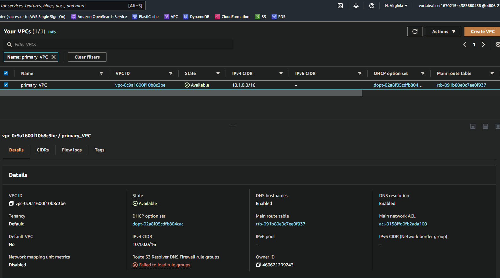

<b> Primary VPC in North Virginia </b>

 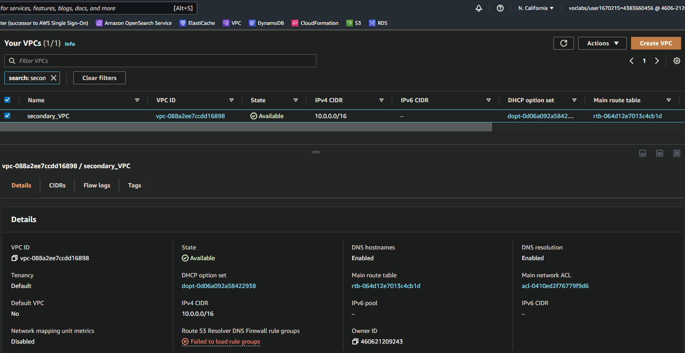

<b> Secondary VPC in North California </b>

_____

## A.1 Highly durable RDS Database

1. Create a new RDS Subnet group in the active and standby region using private subnets.

2. Create a new MySQL, multi-AZ database in the active region. The database must:

* Be a **burstable** instance class.
* Have only the **UDARR-Database** security group.
* Have an initial database called **udacity**.

3. Create a read replica database in the standby region. This database has the same requirements as the database in the active region.

**SAVE**: Screenshots of the configuration of the databases in the active and secondary region after they are created. Also, save screenshots of the configuration of the database subnet groups as well as route tables associated with those subnets.
____

### A.1.1 Primary and Secondary Database Config

 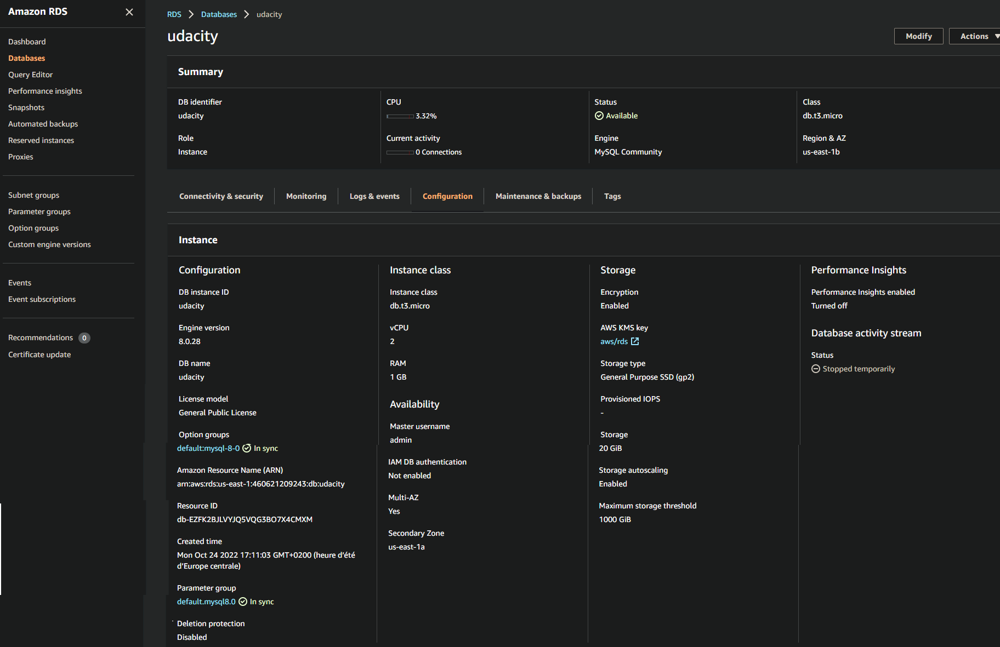

<b> Primary VPC in North Virginia </b>

 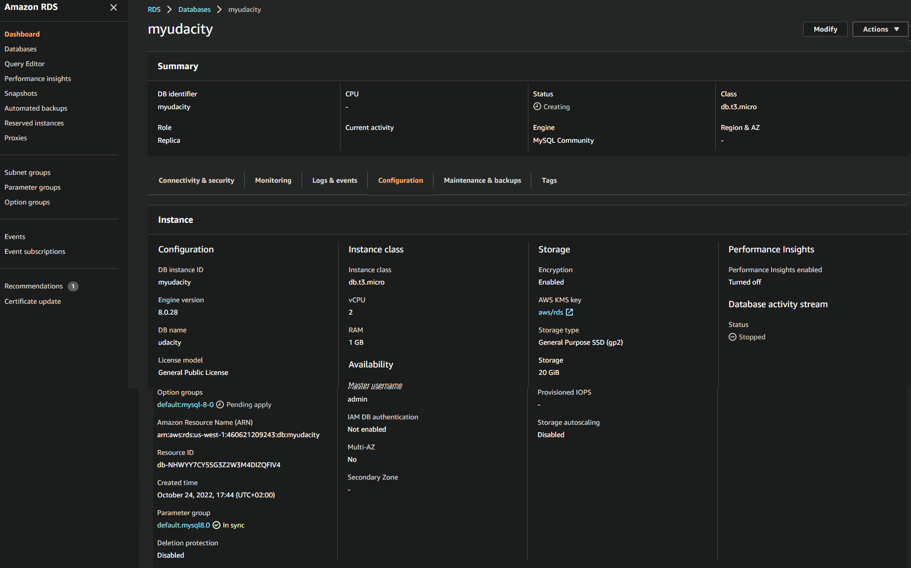

<b> Secondary VPC in North California </b>

### A.1.2 Primary and Secondary Database Subnet Groups

 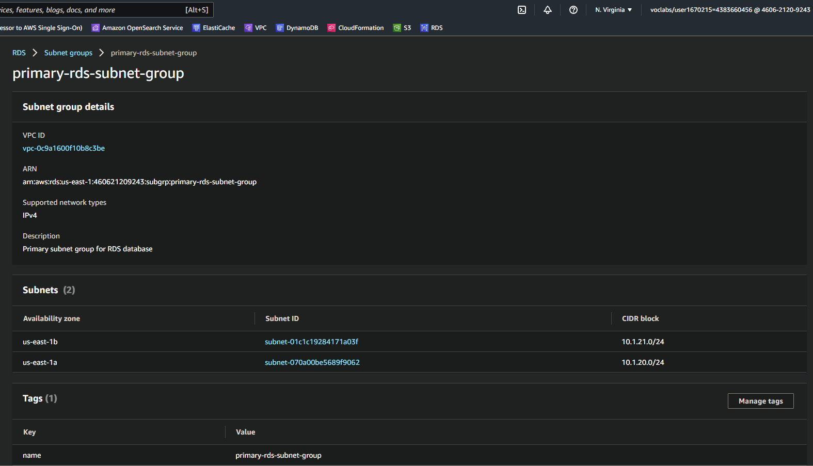

<b> Primary Database Subnet groups in North Virginia </b>

 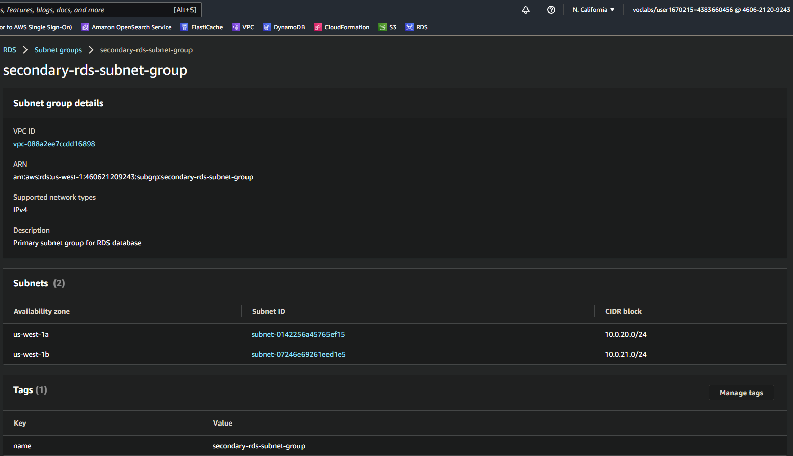

<b> Secondary Database Subnet groups in North California </b>

### A.1.3 Primary and Secondary VPC Subnets

 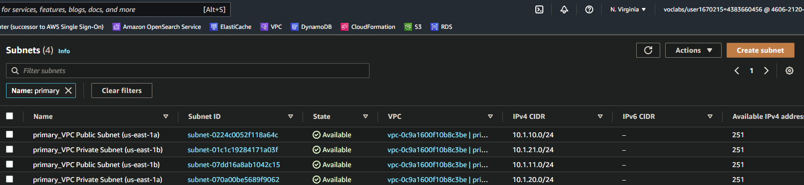

<b> Primary VPC subnet in North Virginia </b>

 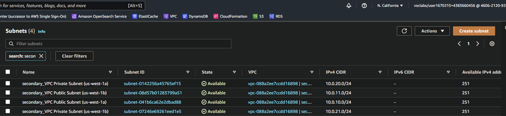

<b> Secondary VPC subnet in North California </b>

### A.1.4 Primary and Secondary Subnet Routing

 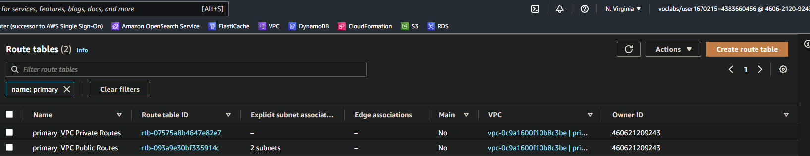

<b> Primary VPC subnet routing in North Virginia </b>

 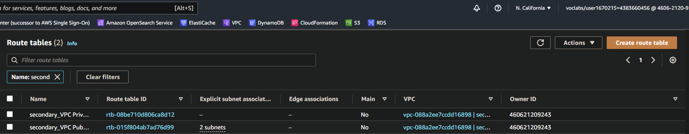

<b> Secondary VPC subnet routing in North California </b>

## A.2 Availability Estimate

Write a paragraph or two describing the achievable Recovery Time Objective (RTO) and Recovery Point Objective (RPO) for this Multi-AZ, multi-region database in terms of:

1. Minimum RTO for a single AZ outage
2. Minimum RTO for a single region outage
3. Minimum RPO for a single AZ outage
4. Minimum RPO for a single region outage

**Save** your answers in a text file named [estimate.txt](./estimates.md)

## A.3 Demonstrate normal usage

In the **active** region:

1. Create an EC2 keypair in the region

2. Launch an Amazon Linux EC2 instance in the active region. Configure the instance to use the VPC's public subnet and security group (**UDARR-Application**).

3. SSH to the instance and connect to the "udacity" database in the RDS instance.

4. Verify that you can create a table, insert data, and read data from the database.

5. You have now demonstrated that you can read and write to the primary database.

**Save** the log of connecting to the databse, creating the table, writing to and reading from the table in a text file called [log_primary.txt](./log_primary.sql)

## A.4 Monitor database

1. Observe the **DB Connections** to the database and how this metric changes as you connect to the database

2. Observe the **Replication** configuration with your multi-region read replica.

**Save** screenshots of the DB Connections and the database replication configuration. Name your screenshots:

 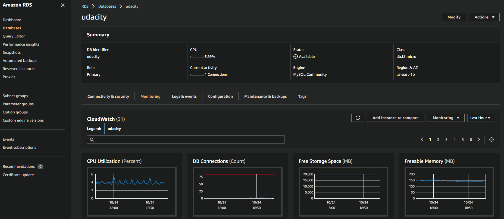

<b> Primary VPC subnet in North Virginia </b>

 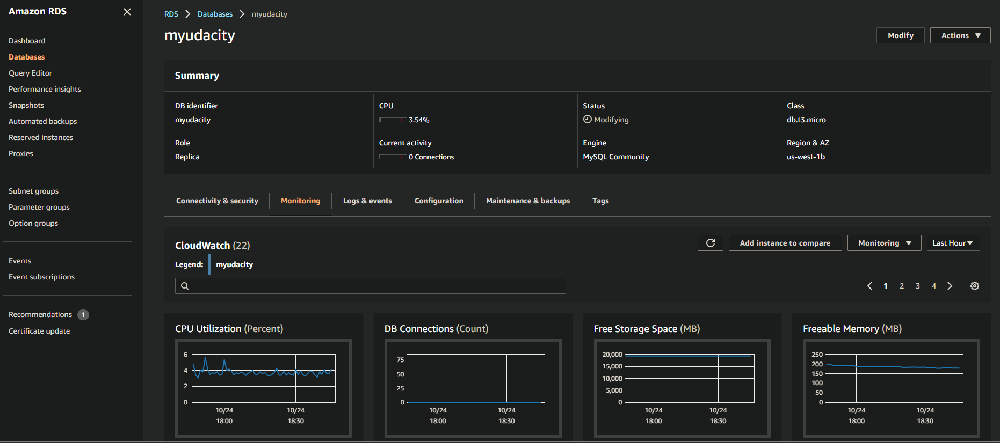

<b> Secondary VPC subnet in North California </b>

