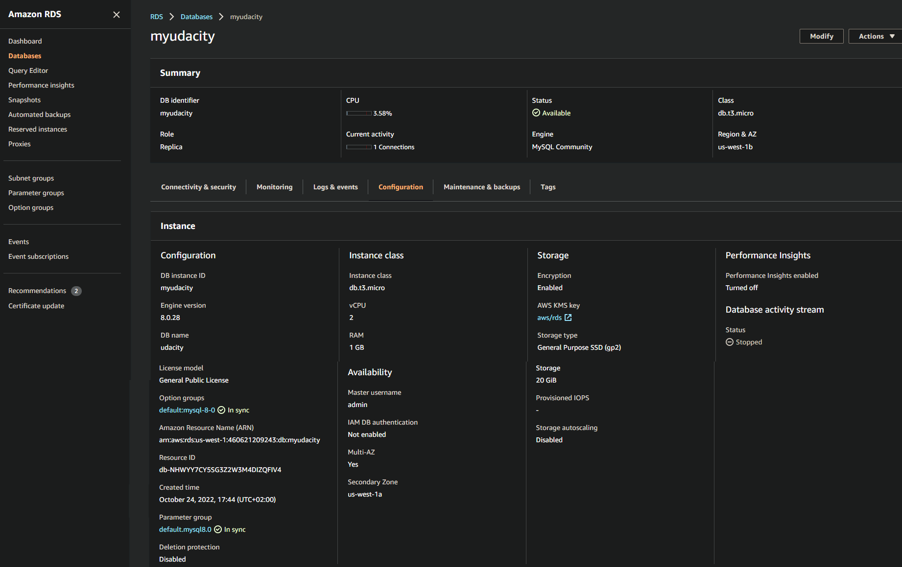
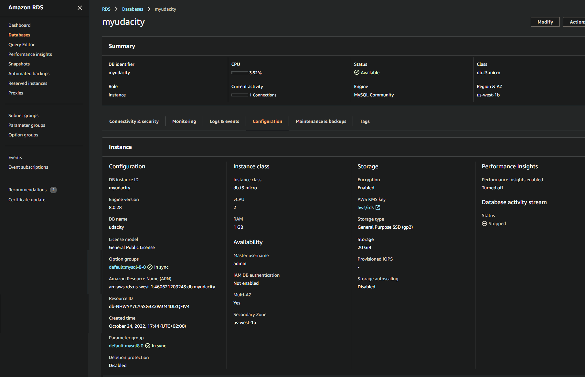

# Failover And Recovery
In the standby region:

1. Create an EC2 keypair in the region

2. Launch an Amazon Linux EC2 instance in the standby region. Configure the instance to use the VPC's public subnet and security group (**UDARR-Application**).

3. SSH to the instance and connect to the read replica database.

4. Verify if you are not able to insert data into the database but are able to read from the database.
5. You have now demonstrated that you can only read from the read replica database.
Task List

**SAVE** log of connecting to the database, writing to and reading from the table in a text file called [log_rr_before_promotion.txt](./lo_rr_before_promotions.sql)

**SAVE** screenshot of the database configuration now, (before promoting the read replica database in the next step) named: [rr_before_promotion.png](./fig/04-rr_before_promotion.png)

 

<b> Database in standby region before proting read replicate </b>

6. Promote the read replica

7. Verify that if you are able to insert data into and read from the read replica database.

8. You have now demonstrated that you can read and write the promoted database in the standby region.

**SAVE** log of connecting to the database, writing to and reading from the database in a text file named [log_rr_after_promotion.txt](./lo_rr_after_promotions.sql)

**SAVE** log of connecting to the database, writing to and reading from the database in a text file named [rr_after_promotion.png](./fig/05_rr_after_promotion.png)

 

<b> Read replica Database after beibg promote </b>
