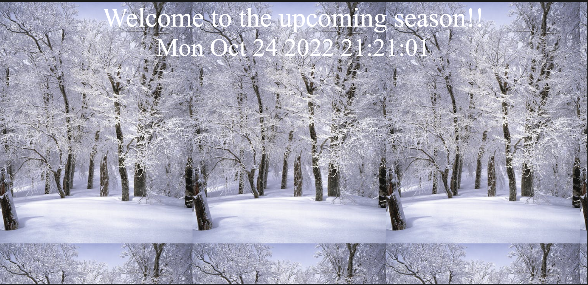
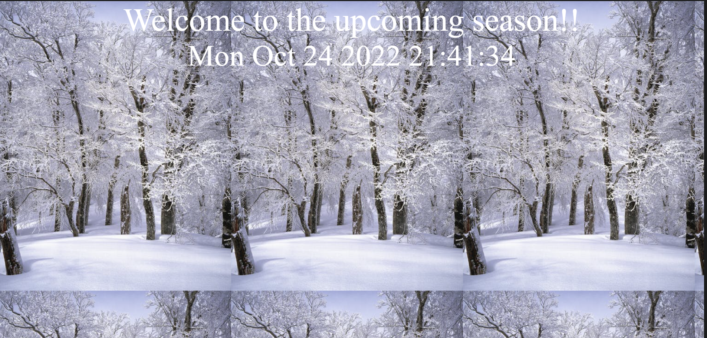
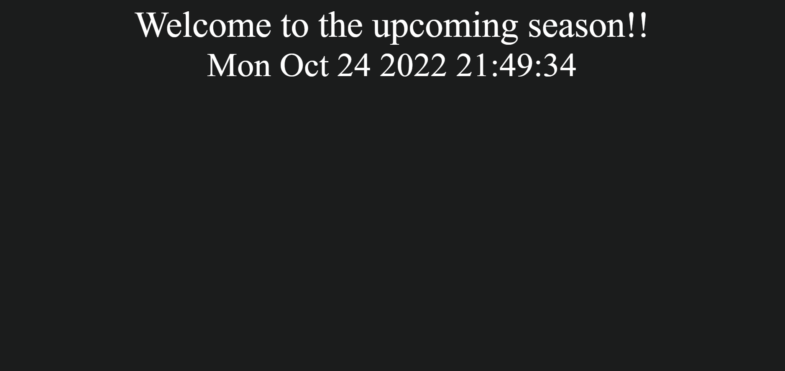
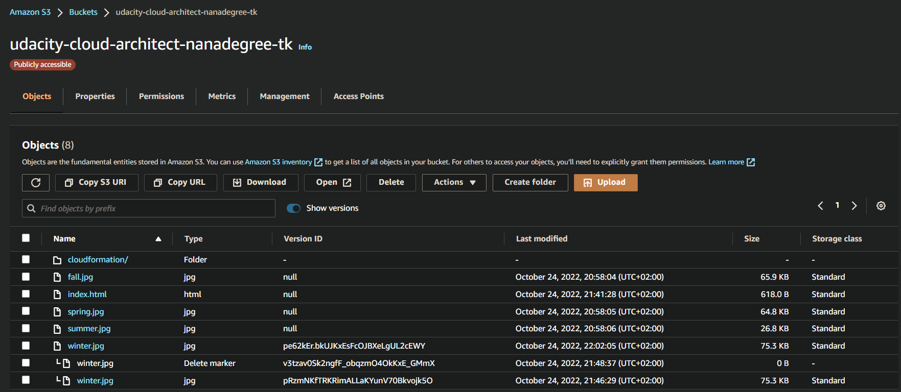
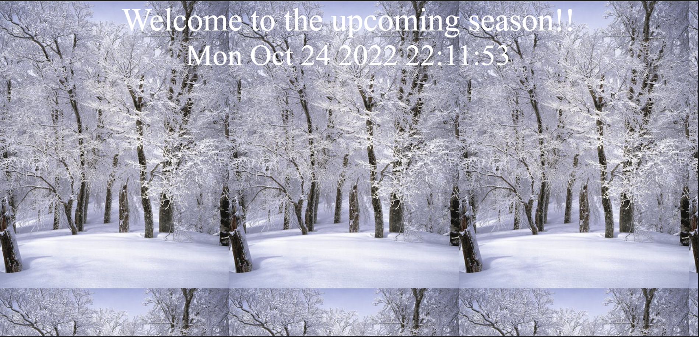

# Website Resiliency

## A.1 Build a resilient static web hosting solution in AWS. 
Create a versioned S3 bucket and configure it as a static website.

1. Enter **index.html** for both Index document and Error document

2. Upload the files from the GitHub repo (under ``/project/s3/``)

3. Paste URL into a web browser to see your website.

**Save** the screenshot of the webpage. Name your screenshot [s3_original.png](./fig/06-s3_original.png)

 

<b> Original Web Page </b>

## A.2 You will now **accidentally** change the contents of the website such that it is no longer serving the correct content

1. Change index.html to refer to a different **season**
2. Re-upload `**index.html**
3. Refresh web page

**SAVE** a screenshot of the modified webpage. Name your screenshot [s3_season.png](./fig/06-s3_season.png)

 

<b> Modified Web Page </b>

## A.3 You will now need to **recover** the website by rolling the content back to a previous version.

1. Recover the **index.html** object back to the original version
2. Refresh web page

**SAVE** a screenshot of the modified webpage. Name your screenshot [s3_season_revert.png](./fig/06-s3_season_revert.png)

 

<b> Season revert Web Page </b>

## A.5 You will now “accidentally” delete contents from the S3 bucket. Delete **winter.jpg**

**SAVE** screenshots of the modified webpage and of the existing versions of the file showing the **Deletion marker**. Name your screenshots:

 

<b> S3 deletion </b>

 

<b> S3 deletion marker </b>

## A.6 You will now need to **recover** the object:

1. Recover the deleted object
2. Refresh web page

**SAVE** a screenshot of the modified webpage. Name your screenshot [s3_delete_revert.png](./fig/06-s3_delete_revert.png)

 

<b> S3 delete revert </b>