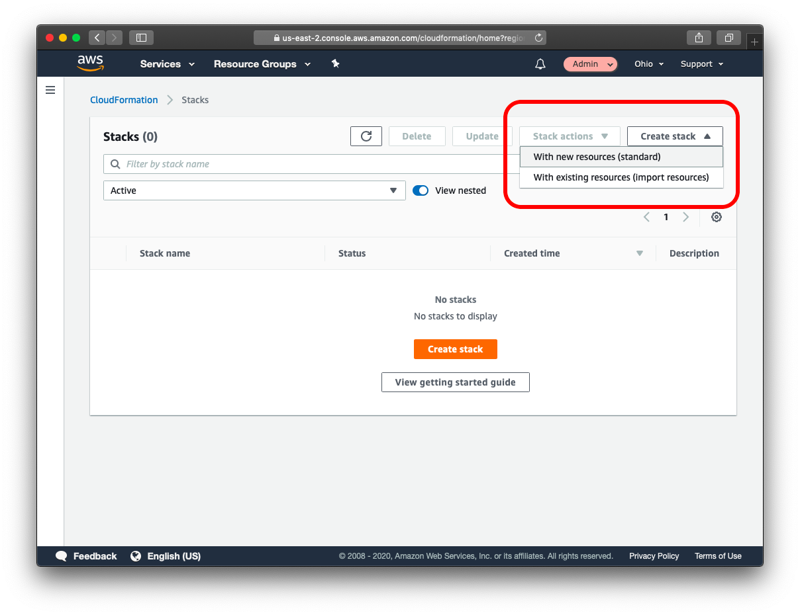
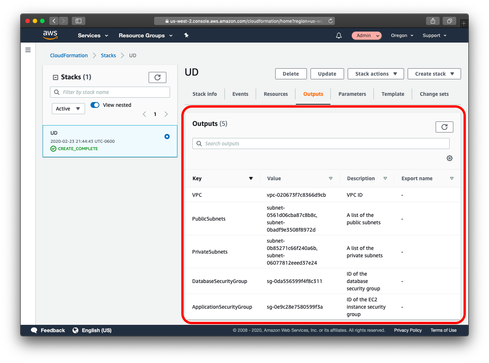

# Project: Recoverability In AWS

<figure>
  

  
 <figcaption></figcaption>
</figure>

In this project you will create **highly available solutions to common use cases**. You will build a **Multi-AvailabilityZone, Multi-Region database and show how to use it in multiple geographically separate AWS regions**. You will also build a website hosting solution that is versioned so that any data destruction and accidents can be quickly and easily undone.

## A.1 GitHub Repository

To get started, clone this GitHub repository. Aside from instructions, it contains a **CloudFormation** script to build an **AWS VPC** with public and private subnets. It also contains an example website that you will host in an **AWS S3** bucket in your account.

<https://github.com/udacity/nd063-c2-design-for-availability-resilience-reliability-replacement-project-starter-template>

## A.2 CloudFormation

In this project, you will use the [AWS CloudFormation](https://aws.amazon.com/cloudformation/) to create **Virtual Private Clouds**.
> **CloudFormation** is an AWS service that allows you to create **infrastructure as code$**.

This allows you to define the infrastructure you'd like to create in code, just like you do with software. This has the benefits of being able to share your infrastructure in a common language, use source code control systems to version your infrastructure and allows for documenting and reviewing of infrastructure and infrastructure proposed changes.

**CloudFormation** allows you to use a configuration file written in a YAML file to automate the creation of AWS resources such as VPCs. In this project, you will use a pre-made **CloudFormation** template to get you started. This will allow you to create some of the infrastructure that you'll need without spending a lot of time learning details that are beyond the scope of this course.

You can find the YAML file in the GitHub repo: <https://github.com/udacity/nd063-c2-design-for-availability-resilience-reliability-replacement-project-starter-template/blob/master/cloudformation/vpc.yaml>

In order to build a VPC from the YAML file, follow the steps (keep in mind you'll want to name the primary VPC "Primary" and the secondary VPC "Secondary":

1. Services -> CloudFormation
2. Create stack **With new resources (standard)**
3. Template is ready
4. Upload a template file
5. Click “Choose file” button
6. Select provided YAML file
7. Next

<figure>
    
 <figcaption></figcaption>
</figure>

8. Fill in Stack name
9. Name the VPC
10. Update the CIDR blocks
11. Click Next
12. Click Next again
13. Click Create stack
14. Wait for the stack to build out. Refresh until status becomes **CREATE_COMPLETE**
15. Observe the “Outputs” tab for the created IDs. These will be used later.

Once the **loudFormation** Stack has completed, you can look at the "Resources" tab to see all of the AWS resources that the stack has created. You can see both the type of resources that have been created, as well as the **AWS identifiers** for those resources so that you can locate these resources in the **AWS service** that they are a part of.

The **Output** tab shows you custom output from the **CloudFormation** Stack that is labeled and described for you. These descriptions are custom descriptions that were added to the **CloudFormation** template and make it easier for you to find specific values that have been created as a part of the **CloudFormation** stack.
Here, you can find the VPC ID that has been created, the subnet IDs including which subnets are public and which are private, and the Security Groups that have been created and a description of each.

<figure>
    
 <figcaption></figcaption>
</figure>

## [Part1: Data Durability And Recovery](./Part1_Data_Durability_And_Recovery.md)

## [Part2: Failover And Recovery](./Part2_Failover_And_Recovery.md)

## [Part3: Website Resiliency](./Part3_Website_Resiliency.md)